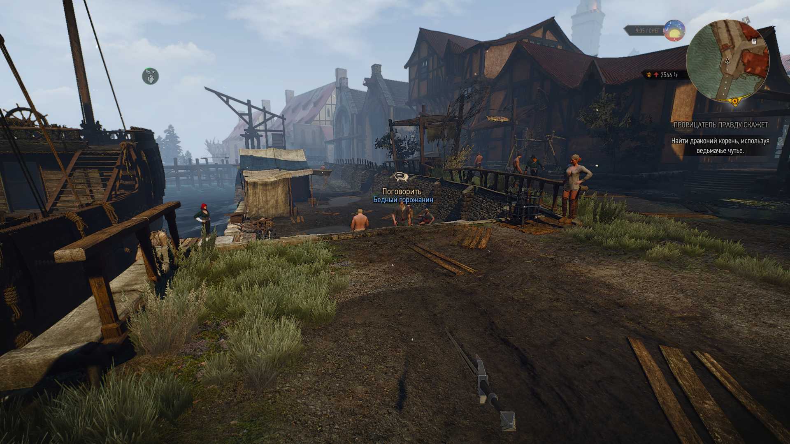
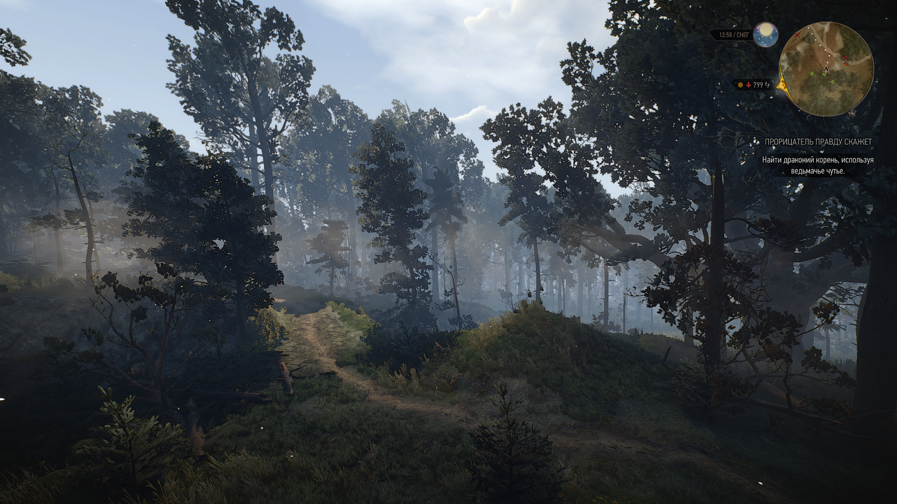
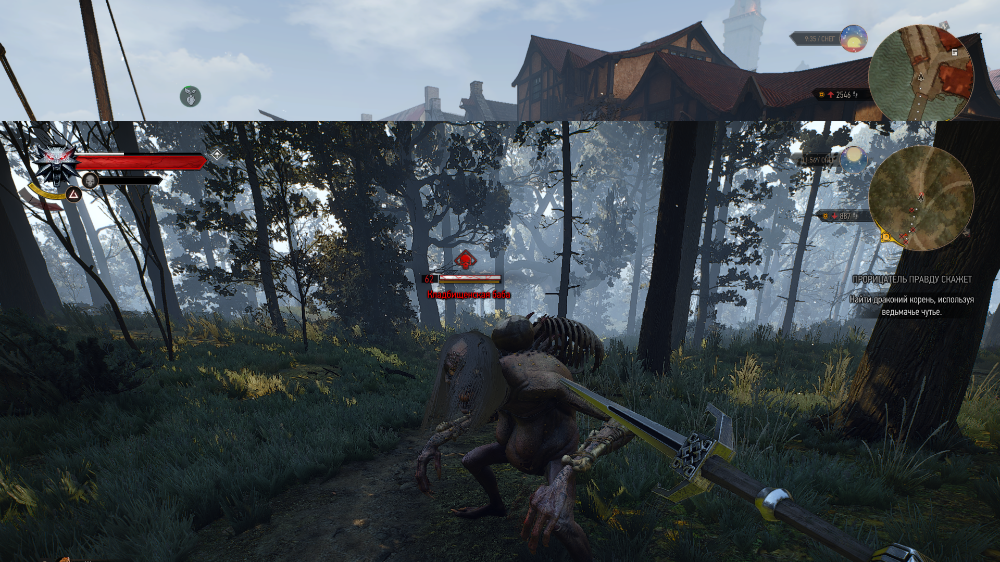
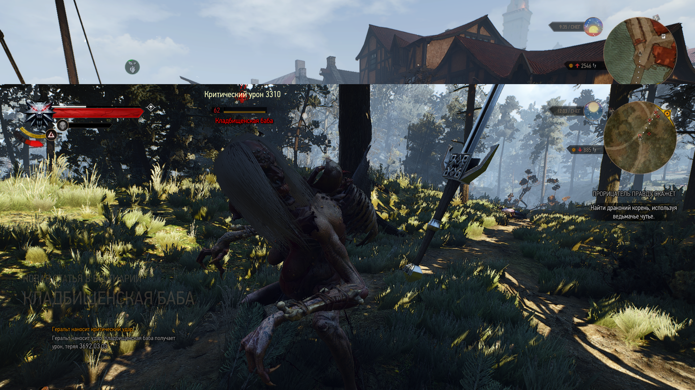
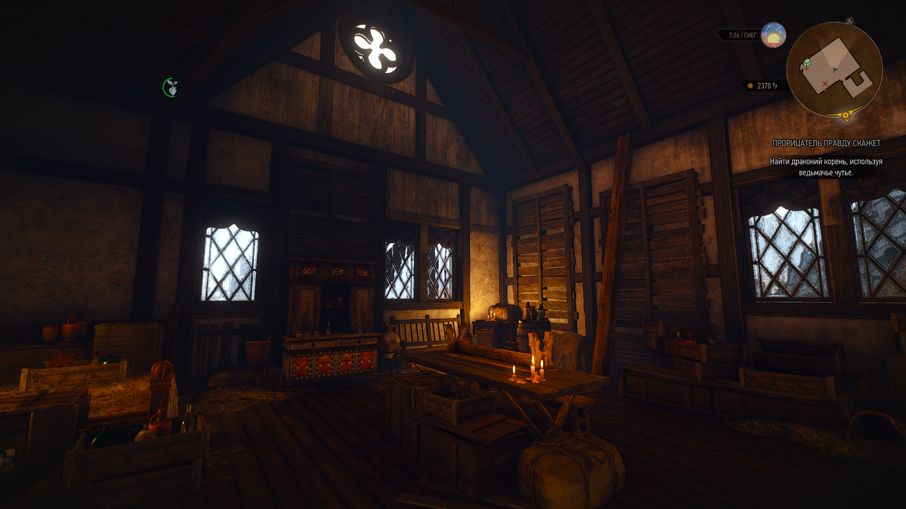
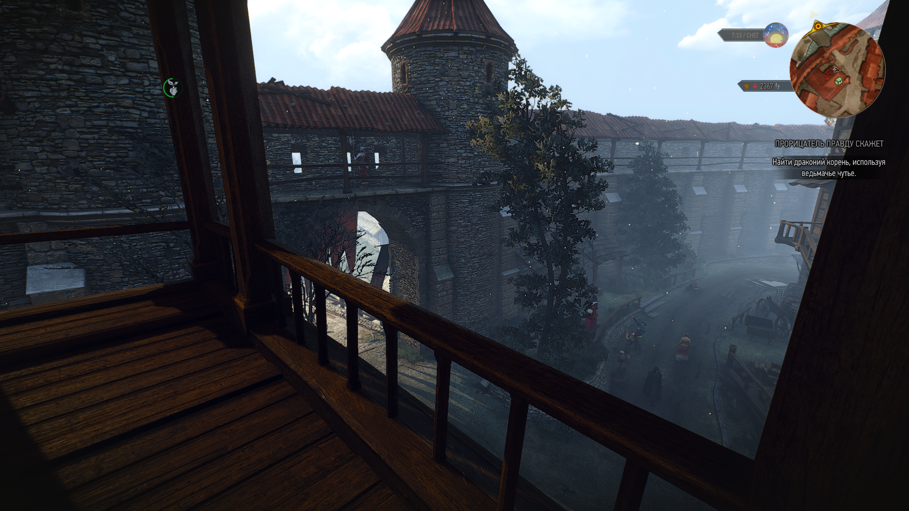

[Переключиться на русскую версию](README_RU.md)

# FIRST PERSON CAMERA REWORKED - mod for playing The Witcher 3 from the first person

[NEXUS](https://www.nexusmods.com/witcher3/mods/6025)

The mod takes into account the errors of the mods [First Person Improved](https://www.nexusmods.com/witcher3/mods/4889/) and [modFirstPerson](https://www.nexusmods.com/witcher3/mods/1862).

Makes control more convenient and fixes some problems, such as displaying swords, crossbows, camera shifts during different actions (for example, attack or sprint), use of the witcher's instinct.

[YouTube Demo 1](https://youtu.be/pR7JSyFB40U)
[YouTube Demo 2](https://www.youtube.com/watch?v=YuHIzRj-BTU)

# Differences between FPCR and Gervant First Person

[Gervant First Person](https://www.nexusmods.com/witcher3/mods/5706?tab=files) is a mod written by another developer around the same time as this mod.

In contrast to the FPCR, the GFP mod is more elaborated for first-person gameplay, due to which some animations have been simplified. Use FPCR if you want control responsiveness closer to the vanilla version or GFP for a more complete first person experience.

# Installation instructions
1. Unpack the mod archive to the root of the game folder.
2. Add to the file `C:\Users\<your user name>\ Documents\ The Witcher 3\input.settings` lines from `add_to_inputsettings.settings`, each at the beginning of its category.
3. Add the lines from `add_to_inputsettings.xml` to the file`\The Witcher 3 Wild Hunt\ bin\config\r4game\ user_config_matrix\pc\input.xml`.
4. Use [Script Merger](https://www.nexusmods.com/witcher3/mods/484) if you have other mods installed.
5. Start the game. Go to the mod settings `Settings -> Mods -> Gameplay` and click on the top` ## PRESET_VALUE_DEFAULT`.
6. In the settings, you can also enable first person view in dialogs, but it works with bugs. It's the same with boats.
7. I recommend installing the patch from the [Gervant First Person] mod (https://www.nexusmods.com/witcher3/mods/5706?tab=files) so that objects near the camera (sword, Roach, NPC) do not disappear.

# Usage

Press the `P` button to turn on / off the mod.

# Used third party mods
- [modInvisibleweapons](https://www.nexusmods.com/witcher3/mods/3685) - used the code from here to remove swords if they are not in hand (otherwise they will be in the frame).
- [modinvisibleCrossbow](https://www.nexusmods.com/witcher3/mods/735) - makes the crossbow invisible so that it does not climb into the camera when walking.
- [modFirstPersonHorseCamera](https://www.nexusmods.com/witcher3/mods/436/) - the code from here is partially used for riding a horse.
- [modFirstPerson](https://www.nexusmods.com/witcher3/mods/1862) - used only in dialogs.
- [First Person Improved](https://www.nexusmods.com/witcher3/mods/4889/) - the code of this mod helped me figure it out.
- [Gervant First Person](https://www.nexusmods.com/witcher3/mods/5706?tab=files) - used visibility patch from here.

# Screenshots

