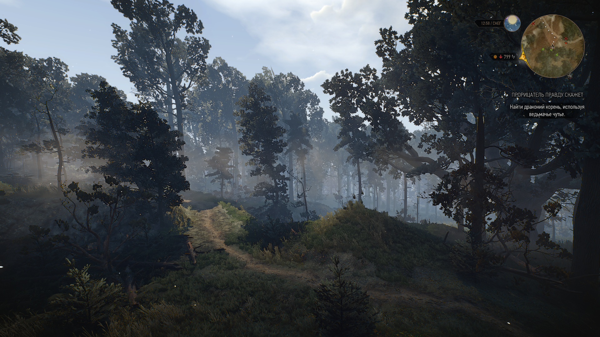
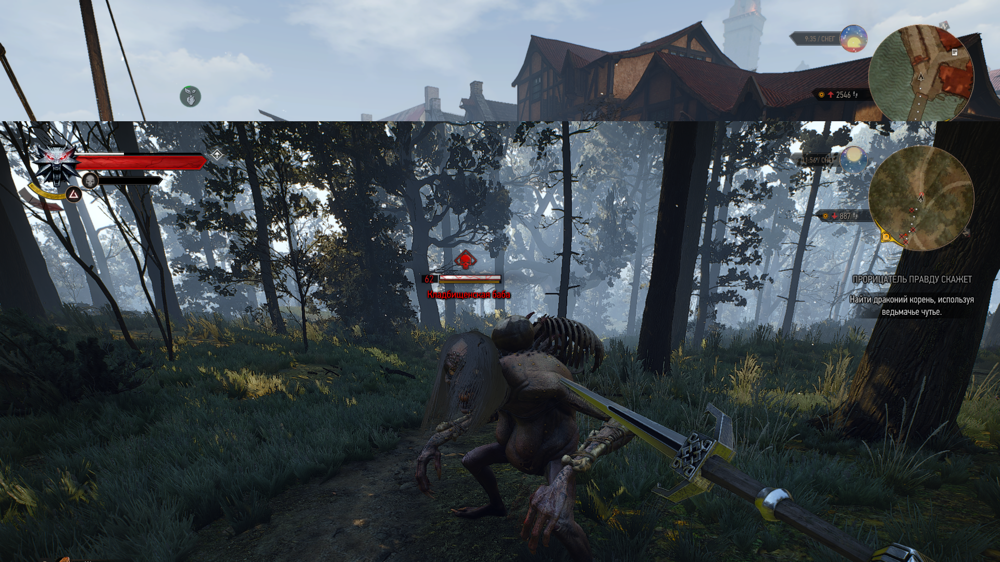

# modFirstPersonCameraReworked - мод для игры в Ведьмак 3 от первого лица

Мод учитывает ошибки модов [First Person Improved](https://www.nexusmods.com/witcher3/mods/4889/) и [modFirstPerson](https://www.nexusmods.com/witcher3/mods/1862). 

Делает управление более удобным и исправляет некоторые проблемы, такие как: отображение мечей, арбалета, сдвиги камеры при разных действиях (например атака или спринт), использование ведьмачьего чутья.

# Инструкция по установке
1. Распакуйте архив с модом в корень папки с игрой.
2. Добавьте в файл `C:\Users\<your user name>\Documents\The Witcher 3\input.settings`.
3. Используйте [Script Merger](https://www.nexusmods.com/witcher3/mods/484) если у вас установлены другие моды.
4. Запустите в игру. Зайдите в настройки модов `Настройки -> Mods -> Игровой процесс` и нажмите вверху `##PRESET_VALUE_DEFAULT`.

# Использование

Нажмите кнопку `P` чтоб включить/выключить мод.

# Используемые сторонние моды
- [modInvisibleweapons](https://www.nexusmods.com/witcher3/mods/3685) - использовал код отсюда чтоб убрать мечи если они не в руке (иначе попадают в кадр).
- [modinvisibleCrossbow](https://www.nexusmods.com/witcher3/mods/735) - делает арбалет невидимым, чтоб он не лез в камеру при ходьбе.
- [modFirstPersonHorseCamera](https://www.nexusmods.com/witcher3/mods/436/) - код отсюда частично использован для езды на лошади.
- [modFirstPerson](https://www.nexusmods.com/witcher3/mods/1862) - используется только в диалогах.
- [First Person Improved](https://www.nexusmods.com/witcher3/mods/4889/) - код этого мода помог мне разобраться.

# Скриншоты

