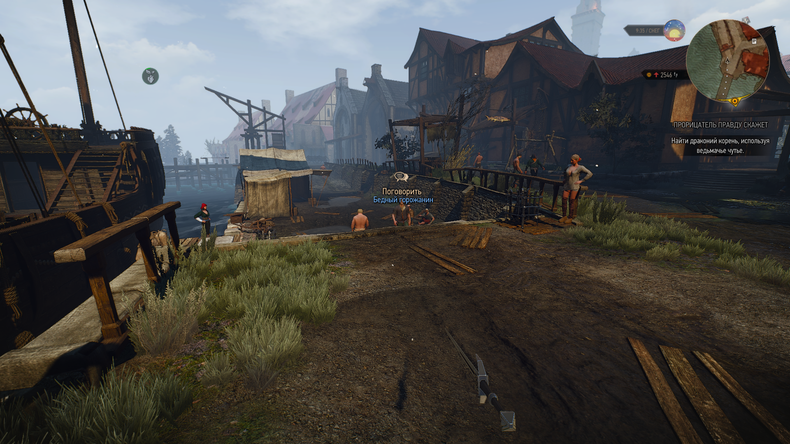
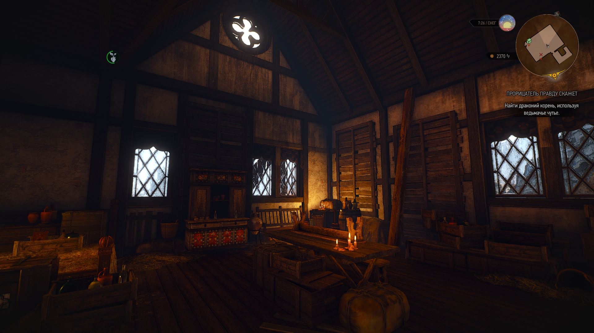
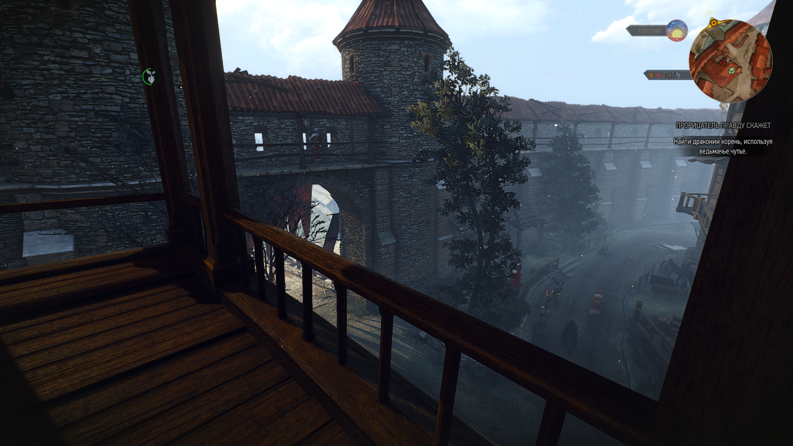

[Switch to English](README.md)

# FIRST PERSON CAMERA REWORKED - мод для игры в Ведьмак 3 от первого лица

[NEXUS](https://www.nexusmods.com/witcher3/mods/6025)

Мод учитывает ошибки модов [First Person Improved](https://www.nexusmods.com/witcher3/mods/4889/) и [modFirstPerson](https://www.nexusmods.com/witcher3/mods/1862). 

Делает управление более удобным и исправляет некоторые проблемы, такие как: отображение мечей, арбалета, сдвиги камеры при разных действиях (например атака или спринт), использование ведьмачьего чутья.

[YouTube Demo](https://www.youtube.com/watch?v=YuHIzRj-BTU)

# Различия между FPCR и Gervant First Person

[Gervant First Person](https://www.nexusmods.com/witcher3/mods/5706?tab=files) - мод написанный другим разработчиком примерно в то же время что и этот мод.

В отличии от FPCR мод GFP более проработан для геймплея от первого лица, из-за чего были упрощены некоторые анимации. Используйте FPCR если хотите отзывчивость управление более близкую к ванильной версии или GFP для более полного экспириенса игры от первого лица.

# Инструкция по установке
1. Распакуйте архив с модом в корень папки с игрой.
2. Добавьте в файл `C:\Users\<your user name>\Documents\The Witcher 3\input.settings` строки из `add_to_inputsettings.settings`, каждую вначале своей категории.
3. Добавьте в файл `\The Witcher 3 Wild Hunt\bin\config\r4game\user_config_matrix\pc\input.xml` строки из `add_to_inputsettings.xml`.
4. Используйте [Script Merger](https://www.nexusmods.com/witcher3/mods/484) если у вас установлены другие моды.
5. Запустите в игру. Зайдите в настройки модов `Настройки -> Mods -> Игровой процесс` и нажмите вверху `##PRESET_VALUE_DEFAULT`.
6. В настройках так же можно включить вид от первого лица в диалогах, но работает с багами. То же самое с лодками.
7. Рекомендую установить патч из мода [Gervant First Person](https://www.nexusmods.com/witcher3/mods/5706?tab=files) чтоб не исчезали предметы вблизи камеры (меч, Плотва, NPC).

# Использование

Нажмите кнопку `P` чтоб включить/выключить мод.

# Используемые сторонние моды
- [modInvisibleweapons](https://www.nexusmods.com/witcher3/mods/3685) - использовал код отсюда чтоб убрать мечи если они не в руке (иначе попадают в кадр).
- [modinvisibleCrossbow](https://www.nexusmods.com/witcher3/mods/735) - делает арбалет невидимым, чтоб он не лез в камеру при ходьбе.
- [modFirstPersonHorseCamera](https://www.nexusmods.com/witcher3/mods/436/) - код отсюда частично использован для езды на лошади.
- [modFirstPerson](https://www.nexusmods.com/witcher3/mods/1862) - используется только в диалогах.
- [First Person Improved](https://www.nexusmods.com/witcher3/mods/4889/) - код этого мода помог мне разобраться.
- [Gervant First Person](https://www.nexusmods.com/witcher3/mods/5706?tab=files) - используется патч видимости объектов отсюда.

# Скриншоты

